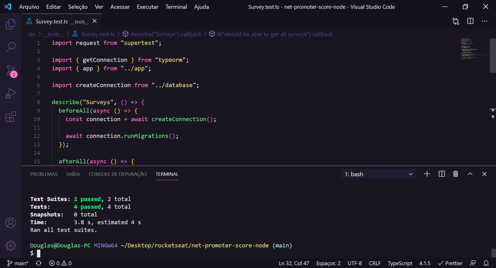

<h1 align="center"></h1>

<h3 align="center">Net Promoter Score - NPS</h3>

<p align="center">“O que sabemos é uma gota. O que ignoramos é um oceano.”</p>

<p align="center">
  <a href="#about">Sobre</a>&nbsp;&nbsp;&nbsp;|&nbsp;&nbsp;&nbsp;
  <a href="#install">Instalação</a>&nbsp;&nbsp;&nbsp;|&nbsp;&nbsp;&nbsp;
  <a href="#challenge">Desafios</a>&nbsp;&nbsp;&nbsp;|&nbsp;&nbsp;&nbsp;
  <a href="#technologies">Tecnologias</a>
</p>

## :speech_balloon: Sobre <a name="about"></a>

> O NPS é uma API que consiste em calcular o Net Promoter Score (métrica que tem como objetivo medir a satisfação e lealdade dos clientes de uma empresa). Nele fazemos o cadastro de usuários e o cadastro de pesquisas. Portanto, um e-mail pode ser enviado ao destinatário para responder à pesquisa de satisfação para realizar os cálculos necessários para obter o NPS.

<br />
<table>
  <tr>
    <td colspan="1">Olha os testes ai :D</td>
  </tr>
  <tr>
    <td></td></td>
  </tr>
</table>

## :warning: Instalação <a name="install"></a>

```bash
# Instalar todas as dependências necessárias:
$ npm install

# Iniciar o projeto em localhost:
$ npm run dev

# Iniciar migrations:
$ npm run typeorm migration:run

# Realizar testes:
$ npm run test

```

## :triangular_flag_on_post: Desafio <a name="challenge"></a>

> Aprender TypeScript, aprimorar a utilização de Banco de Dados e a realização de testes :D

## :heavy_check_mark: Tecnologias <a name="technologies"></a>

- [Jest](https://jestjs.io/)
- [SQLite](https://www.npmjs.com/package/sqlite3)
- [Express](https://expressjs.com/pt-br/)
- [TypeORM](https://typeorm.io/#/)
- [TypeScript](https://www.typescriptlang.org/)
- [Ethereal-Email](https://ethereal.email/)

---

by [Douglas Scaini](https://www.github.com/douglasscaini) ❤️
